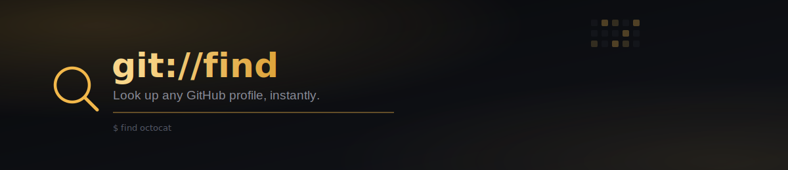
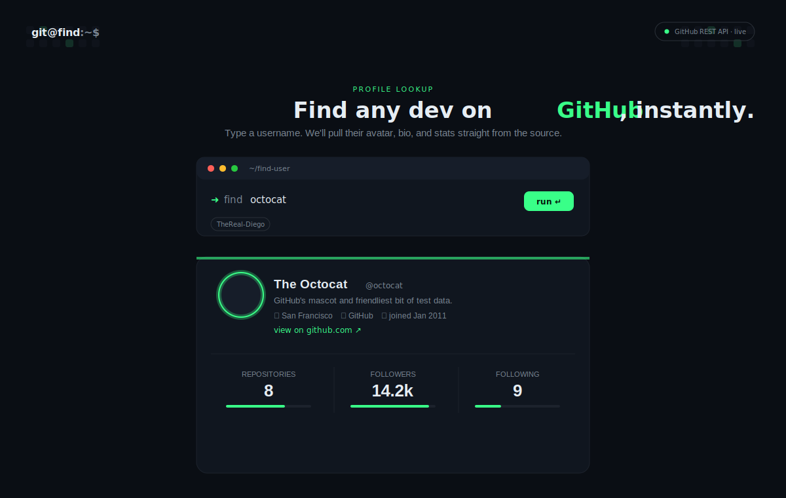

<div align="center">



<br/>


<br/>

**Look up any GitHub user by handle — avatar, bio, and stats, straight from the source.**
A single HTML file. No backend, no build step, no dependencies to install.

<br/>



</div>

<br/>

## ◆ Table of Contents

- [Features](#-features)
- [Live Demo](#-live-demo)
- [Getting Started](#-getting-started)
- [How It Works](#-how-it-works)
- [Project Structure](#-project-structure)
- [Notes on the GitHub API](#-notes-on-the-github-api)
- [License](#-license)

<br/>

## ◆ Features

<table>
<tr>
<td width="50%" valign="top">

**✦ Instant lookup**
Type a username, hit run, and the profile loads straight from the public GitHub REST API — no page reload.

**✦ Terminal aesthetic**
A dark, monospace-driven UI styled like a dev's terminal, right down to the blinking cursor.

**✦ Ambient contribution grid**
A softly animating background grid, styled after GitHub's own contribution graph.

</td>
<td width="50%" valign="top">

**✦ Real profile stats**
Repositories, followers, and following — each with an animated progress bar.

**✦ Handled errors**
Clear, inline messaging for a missing user (404), a hit rate limit (403), or a dropped connection.

**✦ Zero setup**
It's one HTML file. Open it in a browser and it works.

</td>
</tr>
</table>

<br/>

## ◆ Live Demo

Just open `index.html` in any modern browser — there's nothing to install or configure.

<br/>

## ◆ Getting Started

**1 · Clone the repo**

```bash
git clone https://github.com/YOUR_USERNAME/github-profile-finder.git
cd github-profile-finder
```

**2 · Open it**

Double-click `index.html`, or serve it locally if you prefer:

```bash
php -S localhost:8000
```

then visit `http://localhost:8000`.

**3 · Search**

Type any GitHub username into the terminal prompt and hit **run ↵**.

<br/>

## ◆ How It Works

1. On submit, the app calls `https://api.github.com/users/{username}`.
2. A `404` renders a "user not found" message; a `403` flags the unauthenticated rate limit; any other failure shows a generic network error.
3. On success, the response is rendered into a profile card — avatar, name, bio, location, company, join date, and a link back to the user's GitHub profile.
4. Repository, follower, and following counts animate into view as horizontal bars, capped visually at 100 for readability.

<br/>

## ◆ Project Structure

```
github-profile-finder/
├── assets/
│   ├── banner.svg    → README banner
│   └── preview.svg    → README preview mockup
├── index.html          → The entire app — markup, styles, and logic in one file
└── README.md
```

<br/>

## ◆ Notes on the GitHub API

This project calls the **public, unauthenticated** GitHub REST API directly from the browser:

- Unauthenticated requests are rate-limited to **60 per hour, per IP** — the app surfaces this clearly if you hit it.
- No API key or token is required, and none should be added to client-side code — a token embedded in the frontend would be visible to anyone viewing the page source.
- For heavier use, GitHub's authenticated rate limits are far higher, but that requires a backend to keep the token private.

<br/>

## ◆ License

MIT — free to use, modify, and share.

<div align="center">
<br/>
<sub>◆ Built with HTML, CSS, JS, and a little bit of gold.</sub>
</div>
